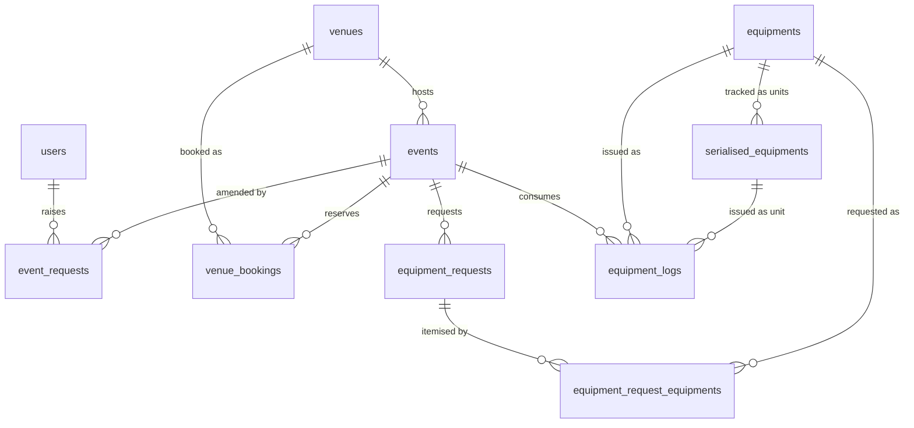

# ConnectSphere — Schema Dictionary

Reference for `V2__init_tables.sql`, updated through `V7__event_request_updated_at.sql`.
Column names, types and constraints below are generated from the migrations and are
authoritative. **Descriptions are a first draft inferred from the SQL comments — correct
anything that misreads the intent.**

`TODO` marks a decision that hasn't been made yet.

- **Database:** PostgreSQL 18
- **Migration tool:** Flyway (`spring.flyway.enabled=true`), runs on app boot
- **Hibernate:** `ddl-auto=validate` — the schema is owned by these files, never by JPA

---

## 1. Domain overview

The system manages the lifecycle of an event from request to completion, plus the
venue and equipment resources an event consumes.

```
  request  ────>  event  ──┬──> venue_booking       (where it happens)
                                  └──> equipment_request   (what it needs)
                                            │
                                            └──> equipment_logs  (what actually went out)
```

1. A user raises an **event_request** — either a *creation* request (no `event_id`) or a
   *change* request against an existing event (`event_id` set). A creation request starts
   life as `draft` (freely incomplete, editable, visible only to its own `organisation`)
   and moves to `pending` only once submitted with all required fields present.
2. On approval the request becomes an **event**.
3. The event is matched to a **venue** and a **venue_booking** is opened.
4. The event raises an **equipment_request**, itemised in `equipment_request_equipments`.
5. Equipment actually issued is recorded in **equipment_logs**, which is what availability
   for any given time window is calculated from.
6. Approval made only after venue is booked and equipment is confirmed.

### Entity relationships



---

## 2. Enum types

Adding a value later is easy (`ALTER TYPE ... ADD VALUE`); renaming or removing one is
painful. Settle these before there is production data.

| Type | Values | Used by |
|---|---|---|
| `user_role` | `ec`, `eo`, `vs`, `attendee`, `technician` | `users.role` |
| `event_status` | `confirmed`, `cancelled`, `completed` | `events.status` |
| `event_request_status` | `draft`, `pending`, `clarification_required` (V13, EC01), `approved`, `rejected`, `cancelled` | `event_requests.status` |
| `equipment_request_status` | `processing`, `approved`, `rejected` | `equipment_requests.status` |
| `equipment_status` | `available`, `in_use`, `damaged`, `maintenance`, `retired` | `serialised_equipments.status` |
| `venue_booking_status` | `pending`, `confirmed`, `changed`, `rejected`, `cancelled` | `venue_bookings.status` |
| `accessibilities` | `accessible_parking`, `drop_off_zone`, `public_transport`, `step_free_access`, `wide_doorways`, `elevators`, `wheelchair_support`, `none` (added V5 — see EO02) | `venues.venue_accessibilities`, `events.accessibility_needs`, `event_requests.accessibility_needs` |
| `facilities` | `audio_visual_equipment`, `air_conditioning`, `breakout_spaces`, `projection`, `stage`, `dining_area`, `barbeque_pit` | `venues.venue_facilities` |

### Role meanings

| Value | Stands for | Description |
|---|---|---|
| `ec` | Event Coordinator| Coordinate event |
| `eo` | Event Organiser | People who organise events |
| `vs` | Venue stuff | In charge of the venues |
| `attendee` | Attendee | End user who attends events |
| `technician` | Technician | Technician — presumably handles equipment issue/return |

### Single-character code columns

These are `CHAR(1)`; the letter-to-meaning mapping lives in application code, not the DB.

| Column | Codes | Meaning |
|---|---|---|
| `event_requests.request_type` | `C` = creation, `A` = amendment/change | Resolved in V3 — a creation request has `event_id IS NULL`; an amendment has it set. |
| `equipments.equipment_type` | TODO | TODO |

---

## 3. Tables

### `users`
People who can log in. Role drives what they may do; `organisation` is free text and may be
null for internal staff.

| Column | Type | Null | Key | Description |
|---|---|---|---|---|
| `user_id` | `UUID` | no | PK | Identifier |
| `hashed_password` | `VARCHAR(255)` | no | | Password hash. TODO — record the algorithm used |
| `email` | `VARCHAR(255)` | no | UQ | Login identity, unique |
| `username` | `VARCHAR(255)` | no | UQ | Display name, unique |
| `created_at` | `TIMESTAMPTZ` | no | | Defaults to `CURRENT_TIMESTAMP` |
| `role` | `user_role` | no | | Determines permissions |
| `organisation` | `VARCHAR(100)` | yes | | Free text; null or `connectSphere` for internal roles |

---

### `refresh_tokens`
Opaque, rotating session credentials (V11, D19 stage 6). Not JWTs, deliberately: the point of this
table is that a session can be *revoked*, and a signed token cannot be. Access tokens live minutes
and are verified by signature alone; these live weeks and are verified against this table.

| Column | Type | Null | Key | Description |
|---|---|---|---|---|
| `token_id` | `UUID` | no | PK | Identifier |
| `user_id` | `UUID` | no | FK → `users` | Owner; `ON DELETE CASCADE` |
| `token_hash` | `VARCHAR(64)` | no | UQ | SHA-256 hex of the token. The token itself is never stored |
| `family_id` | `UUID` | no | IX | Groups every token descended from one login |
| `issued_at` | `TIMESTAMPTZ` | no | | Defaults to `CURRENT_TIMESTAMP` |
| `expires_at` | `TIMESTAMPTZ` | no | | Checked `> issued_at` |
| `revoked_at` | `TIMESTAMPTZ` | yes | | Null means live; set on rotation, logout, or family revocation |

Rotation is single-use: each refresh revokes the presented token and issues a successor in the same
family. A revoked row is kept rather than deleted, because recognising an already-used token is what
makes **reuse detection** possible — presenting one means replay or theft, so the whole family is
revoked and the user must log in again. Hashed with SHA-256 rather than BCrypt on purpose: the value
is 256 bits of CSPRNG output, so there is no low-entropy guess for slow hashing to frustrate.

---

### `venues`
Bookable spaces, with the accessibility and facility attributes used to match them to events.

| Column | Type | Null | Key | Description |
|---|---|---|---|---|
| `venue_id` | `UUID` | no | PK | Identifier |
| `venue_address` | `TEXT` | no | | Full address |
| `supported_layouts` | `TEXT[]` | no | | One-dimensional, nonempty array of supported layouts; null and whitespace-only elements are rejected (V6) |
| `venue_capacity` | `INTEGER` | no | | Overall venue capacity shared by all layouts; 1-50,000 inclusive (V6) |
| `venue_accessibilities` | `accessibilities[]` | no | | Features present. Defaults to `{}` |
| `operating_information` | `TEXT` | no | | Operating days/hours and constraints; must contain non-whitespace text (V6) |
| `venue_facilities` | `facilities[]` | no | | Facilities present. Defaults to `{}` |
| `additional_information` | `TEXT` | yes | | Free-text notes |

**VS06A scope and migration:** V6 renames `venue_layout` to `supported_layouts`
and preserves each legacy text value verbatim as one array element. It does not
guess separators or classify old prose. Existing venues with missing/nonpositive
capacity, capacity above 50,000, missing/blank layout or blank operating information must be corrected
before V6 can run; the migration raises an error instead of inventing values.

Constraints: `chk_venue_capacity_range`, `chk_venue_layouts_nonempty`,
`chk_venue_layout_values` and `chk_venue_operating_information_nonblank`.
The immutable SQL helper `venue_layouts_have_values(text[])` rejects null/blank
array elements. The API DTOs use the Java `VenueLayout` enum: `classroom`,
`theatre`, `boardroom`, `banquet`, `exhibition`. The entity keeps `List<String>`
and the database keeps `text[]`; this migration does not introduce a PostgreSQL
layout enum. Legacy prose values need classification before enum-based DTO reads.

The planned creation form starts capacity at 50, editable by Venue Staff. This is
a frontend initial value, not a database default. Backend input validation (in
`VenueService.createVenue`) rejects omitted/out-of-range capacity, missing/duplicate layouts,
blank address/operating information and addresses over 500 characters; addresses
are trimmed, not checked for real-world existence. These DTO/service rules are
distinct from the database constraints documented above.

Operating information remains human-readable text (for example, "Mon-Fri,
09:00-18:00; closed on public holidays"). These constraints ensure it is present,
not that the schedule can be calculated automatically. Structured hours, booking
availability remain separate stories. Venue address remains required.
The Venue API now records accessibility/facility selections in the existing enum
arrays. Omitted/null lists become empty; duplicate/null entries are rejected.
Accessibility `none` explicitly records no provisions and is exclusive. The entity
uses string collections with write casts to `accessibilities[]` / `facilities[]`,
preserving database enum validation and existing GIN indexes (see `docs/venue-api.md`).

**Indexes**

| Name | Definition | Purpose |
|---|---|---|
| `idx_venue_accessibility` | `GIN (venue_accessibilities)` | Containment filtering, e.g. `venue_accessibilities @> '{wheelchair_support}'` |
| `idx_venue_facility` | `GIN (venue_facilities)` | Same, for facilities |

> Use the `@>` containment operator to hit these indexes. `= ANY(...)` will not use them.

---

### `events`
A confirmed event. Created from an approved `event_request`.

| Column | Type | Null | Key | Description |
|---|---|---|---|---|
| `event_id` | `UUID` | no | PK | Identifier |
| `event_name` | `VARCHAR(255)` | no | | Title |
| `purpose` | `TEXT` | no | | Why the event is being held |
| `description` | `TEXT` | yes | | Longer description |
| `start_datetime` | `TIMESTAMPTZ` | no | | Start |
| `end_datetime` | `TIMESTAMPTZ` | no | | End |
| `expected_attendance` | `INTEGER` | no | | Forecast headcount, used against `venue_capacity` |
| `venue_id` | `UUID` | yes | FK → `venues` | Null until a venue is assigned |
| `accessibility_needs` | `accessibilities[]` | no | | Required features, matched against `venues.venue_accessibilities`. Defaults to `{}` |
| `registration_needs` | `BOOLEAN` | yes | | Whether attendees must register |
| `organisation` | `VARCHAR(100)` | yes | | Owning organisation, free text |
| `actual_attendance` | `INTEGER` | yes | | Recorded after the event |
| `venue_requirements` | `TEXT` | no | | Free-text venue needs |
| `equipment_requirements` | `TEXT` | yes | | Free-text equipment needs. TODO — clarify against `equipment_requests.technical_requirement` |
| `status` | `event_status` | no | | Lifecycle state |

---

### `event_requests`
Requests to create a new event or change an existing one. Mirrors most of `events` because a
request holds proposed values that are not yet live.

| Column | Type | Null | Key | Description |
|---|---|---|---|---|
| `request_id` | `UUID` | no | PK | Identifier |
| `request_type` | `CHAR(1)` | yes | | Creation (`C`) vs amendment (`A`) — see code table above |
| `event_id` | `UUID` | yes | FK → `events` | Set for change requests, null for creation requests |
| `event_name` | `VARCHAR(255)` | **yes (since V3)** | | Proposed title. Nullable while status is `draft`; required to submit (enforced in the app, not the DB) |
| `purpose` | `TEXT` | **yes (since V3)** | | Proposed purpose. Same draft/submit note as `event_name` |
| `description` | `TEXT` | yes | | Proposed description |
| `start_datetime` | `TIMESTAMPTZ` | yes | | Proposed start. Nullable here, `NOT NULL` on `events`; required to submit |
| `end_datetime` | `TIMESTAMPTZ` | yes | | Proposed end. Same note |
| `expected_attendance` | `INTEGER` | **yes (since V3)** | | Proposed headcount. Same draft/submit note |
| `venue_requirements` | `TEXT` | **yes (since V3)** | | Proposed venue needs. Same draft/submit note |
| `equipment_requirements` | `TEXT` | yes | | Proposed equipment needs |
| `accessibility_needs` | **`text[]` (since V4 — see below)** | no | | Proposed required features. Defaults to `{}` |
| `registration_needs` | `BOOLEAN` | yes | | Whether registration is proposed |
| `status` | `event_request_status` | no | | Approval state |
| `created_at` | `TIMESTAMPTZ` | no | | Defaults to `CURRENT_TIMESTAMP` |
| `updated_at` | `TIMESTAMPTZ` | **no (since V7)** | | Last save/submit time; set by `EventRequestService`, not a DB trigger — powers EO01/EO15's "last edited X minutes ago" |
| `organisation` | `VARCHAR(100)` | yes | | Requesting organisation, free text |
| `created_by` | `UUID` | yes | FK → `users` | Requester |

> A request may carry null start/end times while `events` requires them, so approval must
> reject or fill in a request with missing times.
>
> **`status = 'draft'` is the only state where the four columns above may legitimately be
> null.** `EventRequestService.submit()` is the single place that checks all of them are
> present before allowing a transition to `pending` — do not duplicate that check elsewhere,
> and do not rely on the database to catch a missing field once a request leaves `draft`.
>
> **`accessibility_needs` on this table only is `text[]`, not the shared `accessibilities`
> enum-array type** (see V4 migration) — Hibernate 7 could not reliably bind a value into a
> *named* Postgres enum array (two approaches tried against real Postgres both failed; see
> the V4 migration file for the detail). `venues.venue_accessibilities` and
> `events.accessibility_needs` are unaffected and still use the real enum-array type — if you
> implement those tables' entities, do not copy this table's mapping; work out the enum-array
> mapping properly for them, or apply the same `text[]` fallback deliberately and note it here.

---

### `equipments`
Inventory catalogue — one row per equipment *kind*, not per physical unit.

| Column | Type | Null | Key | Description |
|---|---|---|---|---|
| `equipment_id` | `UUID` | no | PK | Identifier |
| `equipment_name` | `VARCHAR(255)` | no | | Display name |
| `equipment_qty` | `INTEGER` | no | | Total units owned. Availability = this minus what is on loan |
| `serialised` | `BOOLEAN` | yes | | True when individual units are tracked in `serialised_equipments` |
| `equipment_type` | `CHAR(1)` | no | | Category code — see code table above |

---

### `serialised_equipments`
Individual physical units of high-value equipment. Only used where `equipments.serialised` is true.

| Column | Type | Null | Key | Description |
|---|---|---|---|---|
| `equipment_id` | `UUID` | no | PK, FK → `equipments` | Which kind of equipment |
| `serial_number` | `VARCHAR(255)` | no | PK | Serial, unique only within an `equipment_id` |
| `status` | `equipment_status` | no | | Condition/availability of this unit |

**Primary key:** `(equipment_id, serial_number)` — serials are only assumed unique per equipment kind.

---

### `equipment_requests`
A request for equipment attached to an event. Header row; the items are in
`equipment_request_equipments`.

| Column | Type | Null | Key | Description |
|---|---|---|---|---|
| `request_id` | `UUID` | no | PK | Identifier |
| `event_id` | `UUID` | no | FK → `events` | Event the equipment is for |
| `status` | `equipment_request_status` | no | | Approval state |
| `technical_requirement` | `TEXT` | no | | Free-text technical needs |
| `reject_reason` | `TEXT` | yes | | Populated only when `status = 'rejected'` |

---

### `equipment_request_equipments`
Line items — what equipment, and how much of it, a request asks for.

| Column | Type | Null | Key | Description |
|---|---|---|---|---|
| `request_id` | `UUID` | no | PK, FK → `equipment_requests` | Parent request |
| `equipment_id` | `UUID` | no | PK, FK → `equipments` | Equipment kind requested |
| `equipment_qty` | `INTEGER` | no | | Quantity requested |

**Primary key:** `(request_id, equipment_id)` — one line per equipment kind per request.

---

### `equipment_logs`
What equipment is actually out, and for how long. This is the table availability is computed
from; `equipment_requests` records intent, this records reality.

| Column | Type | Null | Key | Description |
|---|---|---|---|---|
| `log_id` | `UUID` | no | PK | Identifier |
| `event_id` | `UUID` | no | FK → `events` | Event the equipment went to |
| `equipment_id` | `UUID` | no | FK → `equipments` | Equipment kind |
| `quantity` | `INTEGER` | no | | Units issued. `1` for a serialised unit |
| `technical_requirements` | `TEXT` | yes | | Free-text notes |
| `serial_number` | `VARCHAR(255)` | yes | FK → `serialised_equipments` | Set for serialised units, null for bulk loans |
| `loaned_from` | `TIMESTAMPTZ` | no | | Start of the loan window — may precede the event for setup |
| `loaned_until` | `TIMESTAMPTZ` | no | | End of the loan window — may follow the event for teardown |

**Foreign keys:** `(equipment_id, serial_number)` is a *composite* FK to `serialised_equipments`,
so a log row cannot cite a serial belonging to a different equipment kind. Because
`serial_number` is nullable, the constraint is skipped for bulk loans (`MATCH SIMPLE`).

**Availability for a window** — the query this table exists to serve:

```sql
SELECT e.equipment_name,
       e.equipment_qty                          AS total,
       COALESCE(SUM(l.quantity), 0)             AS on_loan,
       e.equipment_qty - COALESCE(SUM(l.quantity), 0) AS available
FROM equipments e
LEFT JOIN equipment_logs l
       ON l.equipment_id = e.equipment_id
      AND l.loaned_from  < :window_end
      AND l.loaned_until > :window_start
GROUP BY e.equipment_id, e.equipment_name, e.equipment_qty;
```

---

### `venue_bookings`
Reservation of a venue for an event. On a change request the existing booking is cancelled or
marked changed and a new booking row is opened, so an event may have several booking rows
over its life.

| Column | Type | Null | Key | Description |
|---|---|---|---|---|
| `booking_id` | `UUID` | no | PK | Identifier |
| `venue_id` | `UUID` | no | FK → `venues` | Venue reserved |
| `event_id` | `UUID` | no | FK → `events` | Event reserving it |
| `status` | `venue_booking_status` | no | | Booking state |
| `booking_notes` | `TEXT` | yes | | Free-text notes |
| `reject_reason` | `TEXT` | yes | | Populated only when `status = 'rejected'` |
| `submitted_by` | `UUID` | yes | FK → `users` | V13, EC03: coordinator who requested it (null on older rows) |
| `submitted_at` | `TIMESTAMPTZ` | yes | | V13, EC03: when it was requested |
| `suitability_note` | `TEXT` | yes | | V13, EC03: coordinator's justification when the venue lacks a requested accessibility feature |

The booking's time window is the event's `start_datetime`/`end_datetime`, never a copy. EC03
allows at most one `pending`/`confirmed` booking per event; that rule is enforced in
`VenueBookingRequestService` under a row lock on the event, not by a unique index (VS02's test
fixtures deliberately hold several bookings per event).

---

### `event_request_activity` (V13)
Append-only timeline of one event request, from submission through review, clarification,
approval and venue planning (EC01/EC02/EO26/EC03; first slice of DEV07). Every row is written by
a workflow action in the same transaction as the change it describes. **A trigger rejects every
`UPDATE` and `DELETE`**, so history cannot be rewritten even by hand.

| Column | Type | Null | Key | Description |
|---|---|---|---|---|
| `activity_id` | `UUID` | no | PK | Identifier |
| `request_id` | `UUID` | no | FK → `event_requests` | The request whose story this is |
| `event_id` | `UUID` | yes | FK → `events` | Set from approval onwards |
| `activity_type` | `VARCHAR(50)` | no | | `ActivityType` in Java is the whitelist (text, so a new kind of entry needs no migration) |
| `actor_user_id` | `UUID` | no | FK → `users` | Who acted |
| `actor_role` | `VARCHAR(20)` | no | | Their role at the time |
| `actor_name` | `VARCHAR(255)` | no | | Snapshot of their username |
| `message` | `TEXT` | yes | | Clarification, response or reason (max 2000 chars, CHECK) |
| `flagged_fields` | `TEXT[]` | no | | Field keys the coordinator flagged (EC01) |
| `from_status`, `to_status` | `VARCHAR(50)` | yes | | Status change, where there was one |
| `audience_roles` | `TEXT[]` | no | | Roles allowed to see the entry; filtered in the repository query |
| `occurred_at` | `TIMESTAMPTZ` | no | | When |

V13 also added `notifications.message` and `notifications.venue_booking_id` (no FK, on purpose:
a notification is a historical record) and three `notification_type` values:
`clarification_requested`, `clarification_responded`, `venue_booking_requested`.

---

### `mock`, `mock_references` (V1)
Scaffolding from the mock API used to demonstrate the MVC layering. Not part of the domain —
delete once real entities exist.

---

## 4. Conventions

- **Keys** are `UUID`, generated by the application, never sequential integers.
- **Timestamps** are `TIMESTAMPTZ` (UTC on the wire, rendered in the client's zone).
  Never use plain `TIMESTAMP`.
- **Enum arrays** are compared with `@>` so the GIN indexes are used.
- **Free-text** fields are `TEXT`; bounded identifiers are `VARCHAR(n)`.
- **`reject_reason`** is nullable everywhere it appears — only populated on rejection.
- **Migrations are immutable once applied.** Flyway stores a checksum per file; editing an
  already-applied migration makes the next boot fail. Add the next unused `V{n}__*.sql` instead, or reset dev
  with `docker compose down -v`.

## 5. Known gaps / decisions outstanding

| # | Item | Notes |
|---|---|---|
| 1 | No overlap protection on `venue_bookings` | Two confirmed bookings can hold the same venue at the same time. EC03 (V13) refuses a *request* that overlaps a confirmed booking, but pending requests may compete, so **VS03/VS08 must re-check overlap, under a lock, when Venue Staff confirm**. |
| 2 | `organisation` is free text in 3 tables | Accepted for now; risks `connectSphere` / `ConnectSphere` drift |
| 3 | ~~`CHAR(1)` code mappings undocumented~~ | **Resolved in V3** for `request_type` (`C`/`A`) — see §2. `equipment_type` still TODO. |
| 4 | `event_requests` has several nullable fields that `events` requires | Approval path must handle this. Widened in V3 (`event_name`, `purpose`, `expected_attendance`, `venue_requirements` are now also nullable, to support `draft` status) — `EventRequestService.submit()` is where completeness is enforced before a request may leave `draft`. |
| 5 | `equipment_requirements` vs `equipment_requests.technical_requirement` | Overlapping free text — confirm which is authoritative |
| 6 | ~~No audit of who approved a request~~ | **Resolved in V13** for event requests: `event_request_activity` records who submitted, assigned, clarified, responded, approved, rejected and requested a venue, and when. Bookings and registrations are not yet covered (rest of DEV07). |
| 7 | `equipment_logs` has no return/check-in flag | Availability is inferred purely from the loan window |
| 8 | `event_requests.accessibility_needs` is `text[]`, not the shared enum-array type | V4 migration — ORM limitation, not a data-modelling choice. Revisit if `venues`/`events` entities need the same values and a consistent type is wanted across tables. |

## 6. JPA notes for whoever writes the entities

The schema uses Postgres types that plain JPA annotations do not map by default:

- **Enum columns** (`role`, `status`, …) are real Postgres enums, not varchar. Plain
  `@Enumerated(EnumType.STRING)` fails with a type mismatch — use
  `@JdbcTypeCode(SqlTypes.NAMED_ENUM)` (Hibernate 6.2+).
- **Array columns** (`accessibilities[]`, `facilities[]`) need `@JdbcTypeCode(SqlTypes.ARRAY)`.
- **Composite keys** (`serialised_equipments`, `equipment_request_equipments`) need
  `@IdClass` or `@EmbeddedId` — same pattern as the existing `MockReferenceId`.
- Tables with no entity are ignored by `ddl-auto=validate`, so entities can land one at a time.
